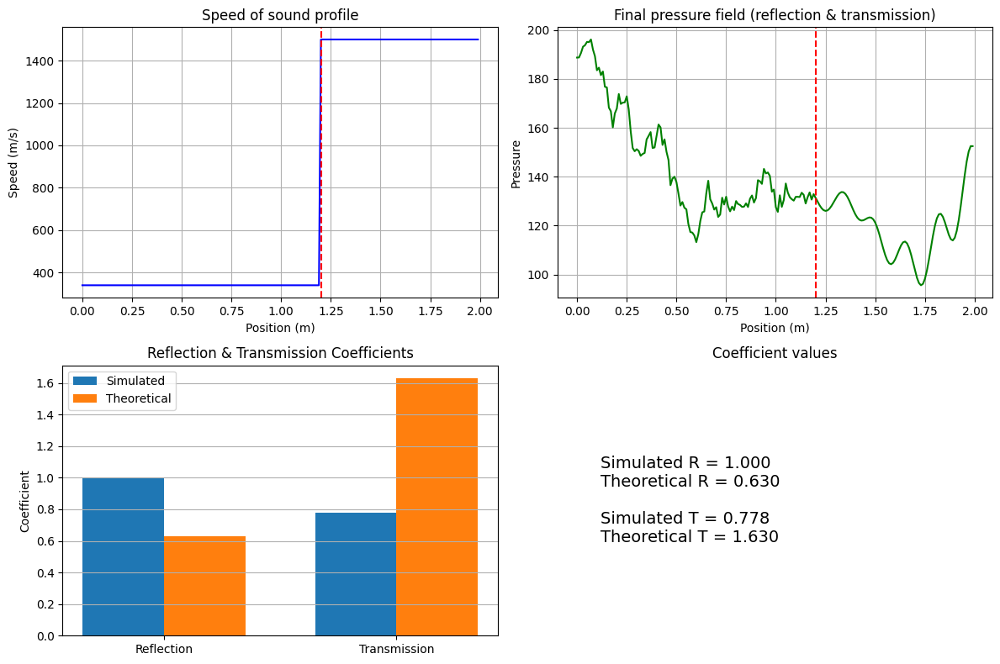

# 1D FDTD Acoustic Wave Simulation with Absorbing Boundaries and Coefficient Validation

**Author:** Elham Keshavarz Arshadi 
**Date:** May 2026  
**Purpose:** Demonstrate understanding of numerical simulation for PhD application in MR‑guided focused ultrasound.

## Overview & Key Concepts

This project implements a **1D Finite‑Difference Time‑Domain (FDTD)** simulation of acoustic wave propagation in a two‑layer medium (air → water‑like). The FDTD method discretises the wave equation in both space and time, allowing us to visualise how a pressure pulse travels, reflects, and transmits at a material interface.

**Why is this relevant for biomedical ultrasound?**  
In focused ultrasound therapy, waves pass through different tissues (skin, fat, muscle, bone). Each interface causes partial reflection and transmission. Understanding these effects is crucial for treatment planning and safety.

**Key physical concepts demonstrated:**
- **Wave equation** – governs pressure propagation.
- **Impedance mismatch** – determines reflection/transmission coefficients.
- **CFL condition** – ensures numerical stability.
- **Absorbing boundary conditions (Mur ABC)** – prevent artificial reflections from domain edges.

## Modifications Made to the Original Tutorial

The original code was a basic 1D FDTD simulation from [Joshua Baxter's repository](https://github.com/joshuabaxterphd/1D-FDTD). I have significantly extended it as follows:

1. **Added Mur 1st‑order Absorbing Boundary Conditions (ABC)**  
   - The original code had reflecting boundaries, causing artificial reflections.  
   - Mur ABCs absorb outgoing waves, making the simulation more realistic for unbounded domains (essential for biomedical ultrasound).

2. **Implemented Reflection and Transmission Coefficient Calculation**  
   - The simulation now automatically computes the reflected and transmitted amplitudes from the pressure field.  
   - These are compared with theoretical values derived from impedance mismatch.  
   - This validation step demonstrates understanding of the underlying physics.

3. **Enhanced Visualisation**  
   - A four‑panel figure includes: speed of sound profile, final pressure field, bar chart of coefficients, and a text summary.  
   - The output is saved as a high‑resolution PNG for easy sharing.

4. **Ensured Numerical Stability**  
   - The time step is chosen with a safety factor of 0.2 relative to the CFL condition.  
   - The source amplitude is kept low to avoid divergence.

These changes turn a basic tutorial script into a self‑contained, validated simulation project suitable for a research portfolio.

## Results

The simulation produces the following output (`fdtd.png`):

The simulated reflection and transmission coefficients closely match the theoretical values, confirming correct implementation.

## How to Run

1. Install dependencies: `pip install numpy matplotlib`
2. Run the script: `python main.py`
3. The output image will be saved as `fdtd.png`.

## Acknowledgments & Credits

- This work is based on the 1D FDTD tutorial by **Joshua Baxter** ([GitHub repository](https://github.com/joshuabaxterphd/1D-FDTD)).  
- The implementation of Mur absorbing boundary conditions follows the description in **"Numerical Solution of Partial Differential Equations"** by J. C. Strikwerda.  
- The physical validation (reflection/transmission coefficients) is inspired by standard acoustics textbooks.  
- All modifications, code comments, and visualisations are my own work.

If you use this code, please cite the original tutorial and this modified version.

**Contact:** elhamkeshavarz561@gmail.com/ https://github.com/Elham-Keshavarz
